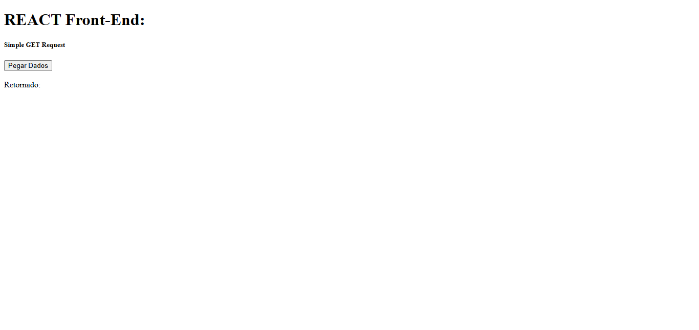
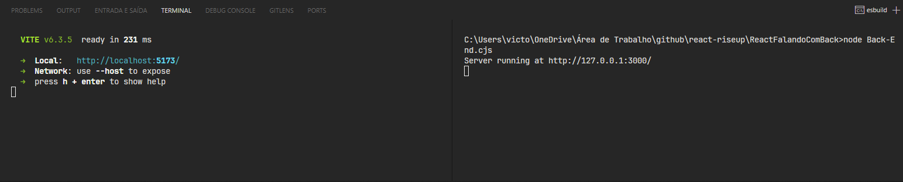
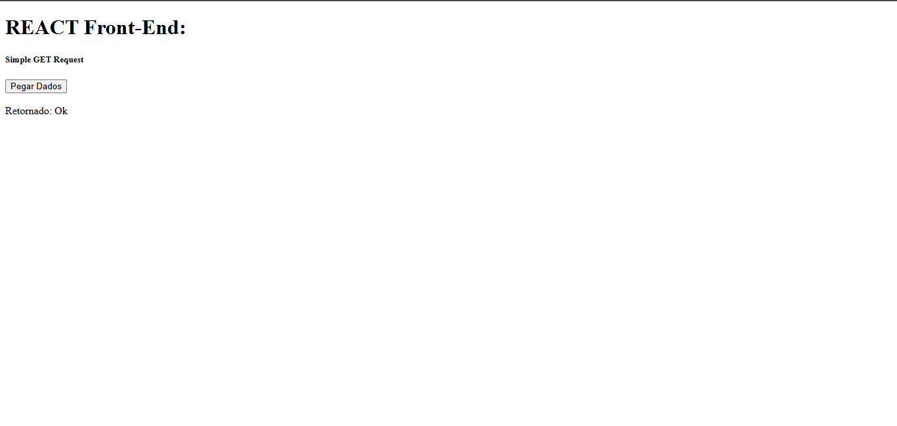
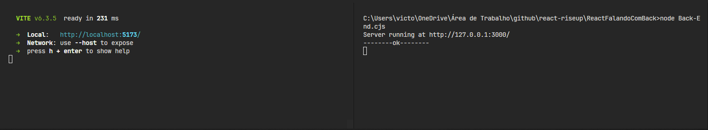

# Comunicação com o BackEnd

## Como rodar o BackEnd
Para rodar o código Back-End nescessário para a aplicação funcionar, antes de tudo é nescessário que o ```NodeJS``` esteja presente na máquina. Com ele presente, é preciso alterar a terminação do arquivo Back-End.js de ```.js``` para ```.cjs```, terminação utilizada para arquivos **CommonJS**.

**Após a alteração na terminação:**

É necessário, no **console** de escolha, navegar até a pasta do arquivo Back-End.**cjs** e executar a linha de código abaixo, para que seja inicializado o servidor Node.

```node Back-End.cjs```

## Como rodar o FrontEnd
Para rodar o código Front-End nescessário para a aplicação funcionar, antes de tudo é nescessário que o ```React``` esteja presente na aplicação. 

**Com o react presente na aplicação:**

É necessário, no **console** de escolha, navegar até a pasta do Front-End e executar a linha de código abaixo, para que seja inicializado o servidor Node.

```npm run dev```

## Imagens do Código Funcionando
### Antes do Clique no botão:




### Após o Clique do botão:


